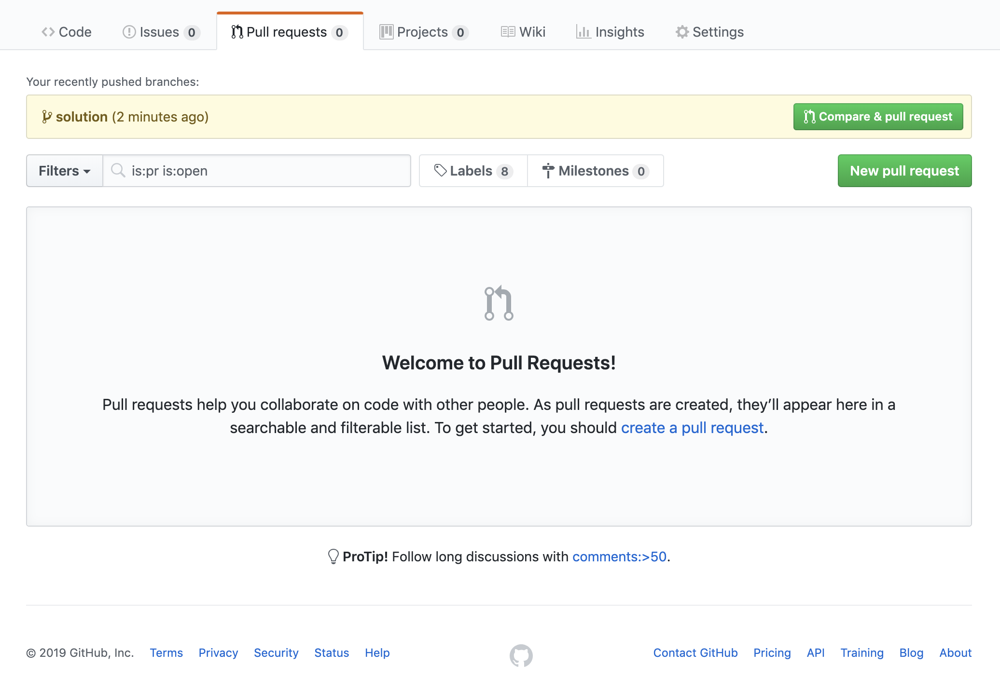
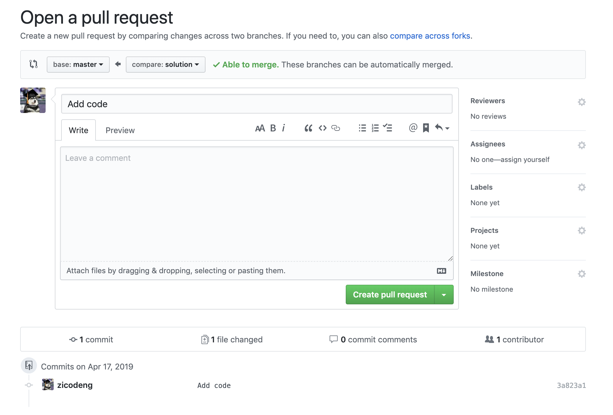

# Submission Guide

We will be using Git to manage and review your assignments. Please follow this guide to submit your assignment:

1. Clone your assignment git repo

   ```sh
   # Clone with HTTPS
   git clone https://github.com/coding-ninjas-bootcamp/<assignment-name>.git

   or

   # Clone with SSH
   git clone git@github.com:coding-ninjas-bootcamp/<assignment-name>.git
   ```

2. Move to your assignment folder

   ```sh
   cd <assignment-name>
   ```

3. Create a new branch named `solution`

   ```sh
   git checkout -b solution
   ```

4. After you are done with your assignment, push `solution` branch to GitHub

   ```sh
   git push --set-upstream origin solution

   git push
   ```

5. Create a PR (Pull Request)

   

   

6. Please do NOT merge it by yourself. Wait your instructor for code review

7. If your instructor believes your code can be improved, he/she will leave some comments and suggestions during code review

8. Address comments and suggestions

9. Push your changes to GitHub again

10. If everything looks good, your instructor will merge the `solution` branch to `master` branch for you. You are good to go!
